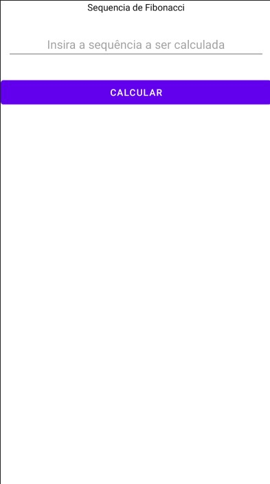

![Renata Borges] 

<h1 align="center">Sequência de Fibonacci</h1>

<h1 align="center">
    Kotlin
</h1>

🚀 Aplicativo Android na linguagem Kotlin para Cálculo da Sequência de Fibonacci

<h1 align="center">
    Tabela de Conteúdos  
    =================
</h1>

 <a href="#objetivo">Objetivo</a> •
 <a href="#roadmap">Roadmap</a> • 
 <a href="#tecnologias">Tecnologias</a> • 
 <a href="#contribuicao">Contribuição</a> • 
 <a href="#licenc-a">Licença</a> • 
 <a href="#autor">Autor</a>

<h4 align="center"> 
	🚧  Kotlin 🚀 Em construção...  🚧
</h4>
### Features

- [x] Inserção de Número
- [x] Botão de Cálculo
- [x] Resultado

### Pré-requisitos

Antes de começar, você vai precisar ter instalado em sua máquina um editor para trabalhar com o código como [Android Studio](https://developer.android.com/studio?authuser=1).

### 🎲 Demonstração da Aplicação

### 🛠 Tecnologias

As seguintes ferramentas foram usadas na construção do projeto:

- [Kotlin](https://kotlinlang.org/)

### Autora

---
 
  
 <b>Renata Borges</b></a>

Feito com ❤️ por Renata Borges 👋🏽 Entre em contato!

  

